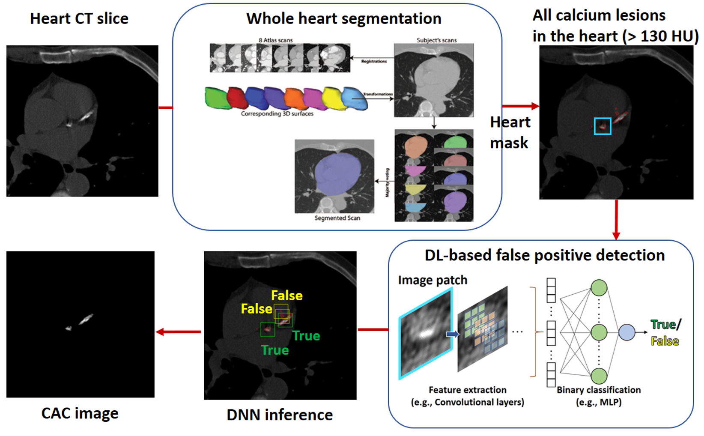

# Automatic Coronary Calcium Scoring from Gated Coronary CT Using DL-based FP detection model
CAC Scoring from NCCT Using DL With External Validation


This work introduces an automatic CAC scoring method that uses multi-atlas segmentation for whole heart segmentation (WHS) and a DL model as a supervised classifier for correcting false positives (FP). <br/>


## Descriptions
- The repository provides a DL-based FP (of CAC) model.
- The model is developed by using the [Stanford AIMI COCA dataset](https://stanfordaimi.azurewebsites.net/datasets/e8ca74dc-8dd4-4340-815a-60b41f6cb2aa) which is publicly available for research purpose
- We used the multi-atlas segmentation pipeline implemented by the [Biomedical Imaging Group Rotterdam (BIGR)](https://bigr.nl/)
- Our work was externally validated on the [Rotterdam Study](https://pubmed.ncbi.nlm.nih.gov/38324224/)

## Run
Generate labeled patches with annotated images 
```bash
python3 patch_prep.py -patch_size 45
```
Split the patch data into non-overlapping 5 folds w.r.t subjects  
```bash
python3 k-fold_prep.py -normalize
```
Evaluate binary classification performance and save the trained models
```bash
python3 fp_classifier_train_subject_fold.py -batch_size 32 -n_epochs 100 -lr 1e-4
```
Compute CAC scores
```bash
python3 coca_internal_eval.py -trained_model 'fp_vgg_trained_model_3.pth'
```
Assess the agreement between computed scores and reference scores
```bash
python3 coca_score_agreement.py
```

## References
```
Mo, Hyunho, Daniel Bos, Maryam Kavousi, Maarten JG Leening, and Esther E. Bron. "Coronary Artery Calcium Scoring from Non-contrast Cardiac CT Using Deep Learning with External Validation." In International Workshop on Statistical Atlases and Computational Models of the Heart, pp. 122-131. Cham: Springer Nature Switzerland, 2024.
```

Bibtex entry ready to be cited
```
@inproceedings{mo2024coronary,
  title={Coronary Artery Calcium Scoring from Non-contrast Cardiac CT Using Deep Learning with External Validation},
  author={Mo, Hyunho and Bos, Daniel and Kavousi, Maryam and Leening, Maarten JG and Bron, Esther E},
  booktitle={International Workshop on Statistical Atlases and Computational Models of the Heart},
  pages={122--131},
  year={2024},
  organization={Springer}
}
```

## Acknowledgments
```
  This work is part of the project MyDigiTwin with project number 628.011.213 of the research programme "COMMIT2DATA - Big Data \& Health" which is partly financed by the Dutch Research Council (NWO). Furthermore, this work used the Dutch national e-infrastructure with the support of the SURF Cooperative using grant no. EINF-7675.
```
